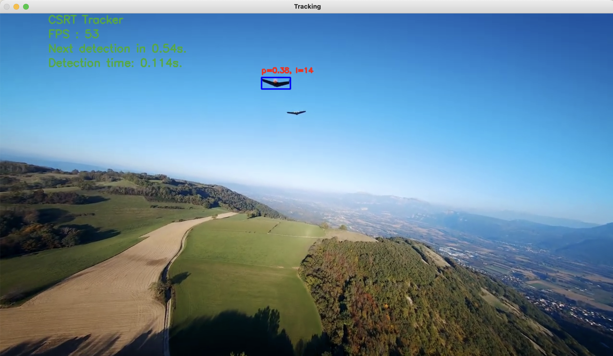

# About this project:

## Demo




On the top left side, we can see the time it took for the last detection in seconds, the time until the next detection is made, also in seconds, the algorithm used, and the number of frames per second the tracker is able to process.

## How this project works:

We utilize the YOLOv8 pre-trained nano model for the detection of various classes, among which the category of aircraft is included. It returns a bounding box of the image. We have a `detection_interval` mode that detects at a given interval, let's say every 2 seconds. During the time when the detector is on standby, we use the CSRT tracker, which takes in a bounding box as input and tracks the object within the frames.

## Performance so far:

Currently, with the CSRT tracker and YOLOv8 nano model, we achieve an average total detection time of 0.15 seconds and 50 fps with tracking. Please note that these metrics apply to my MacBook. More about the limitations in the sections below.

## How to set up this project:

- Update pip.
- Install pip packages from `requirements.txt`.
- Activate virtual environment.
- Run `./src/main.py` script.

## How to customize the project:

Everything you can change can be found in `constants.py`.

```python
ONLY_DETECTION = False

BOUNDING_BOX_COLOR = (255, 0, 0)
ALARM_COLOR = (0, 0, 255)
DEFAULT_COLOR = (50, 170, 50)

VIDEO_OF_INTEREST = "demo-1.mp4"

# 1 (lower fps on avg 30 but more accurate), 7
TRACKER_TYPE = TRACKER_TYPES[1]

DETECTION_TIME_INTERVAL_MS = 1000
REDETECTION_INTERVAL_MS = 300
MISSED_DETECTIONS_UNTIL_LOST = 10

P = 0.6
```

## Limitations of the project and how to fix them:

- The YOLOv8 nano model is pre-trained on all sorts of objects but not specifically on drones. Training the model specifically on drones using transfer learning, utilizing existing weights and data, might result in more accurate and faster detection.
- The video has high resolution, but we actually only need 720p resolution. Reducing the resolution would make the algorithms run faster, resulting in faster average detection time and higher fps for tracking.
- The code runs faster, and metrics improve when running with GPU.
- Presently, the system operates effectively with a solitary object; otherwise, it becomes perplexed.
- It exclusively renders bounding boxes around entities identified as airplanes, disregarding all other objects. One potential resolution entails displaying rectangles for all objects while maintaining the tracking focus solely on a single airplane.
